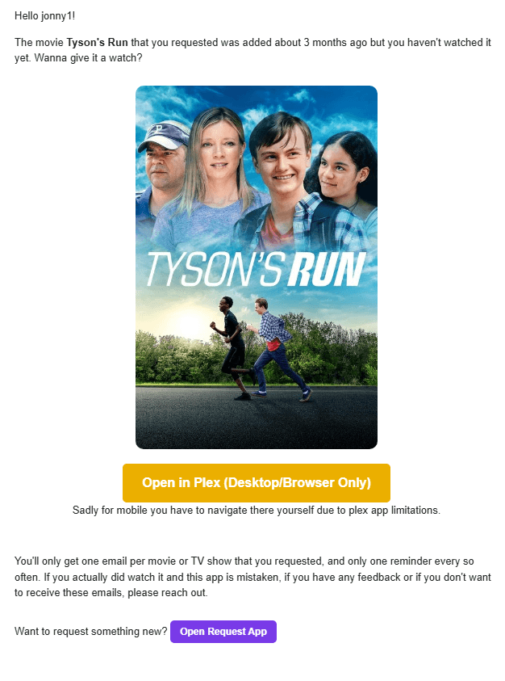
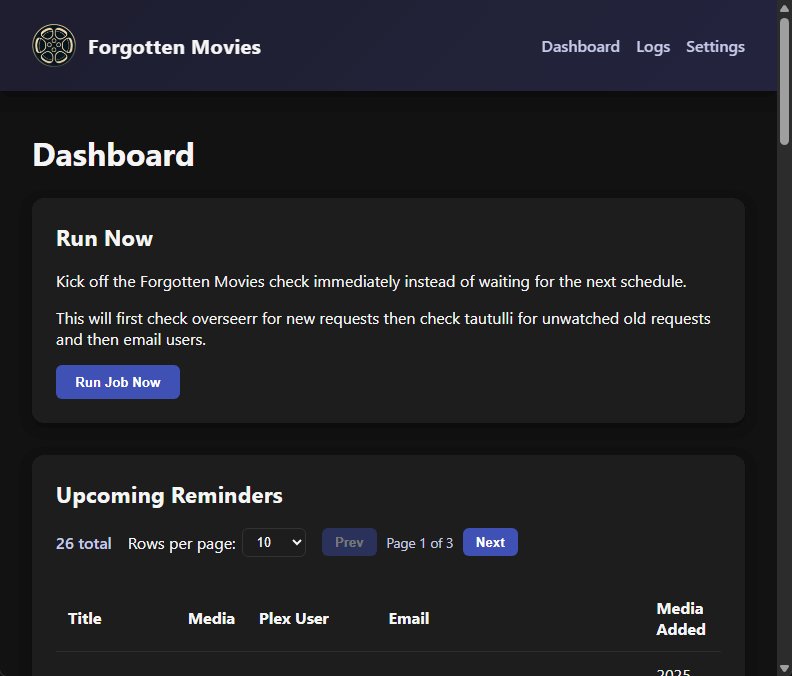
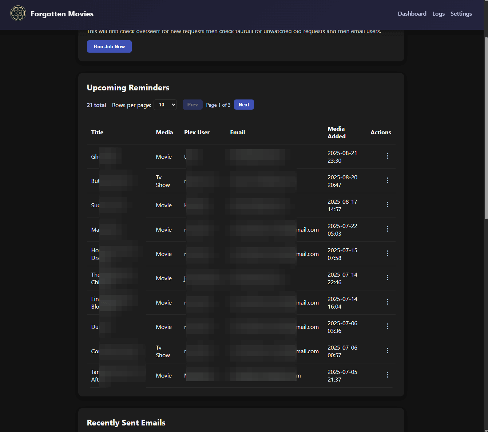

#  Forgotten Movies 

Forgotten Movies keeps Plex requests from gathering dust. It watches Overseerr for requests that have been fulfilled, checks Tautulli to see whether the requester actually watched them, and sends a friendly email reminder when something has been available for too long.                 


# Features

- **Automated reminders:** Periodically scan Overseerr, cross-reference Tautulli history, and sends emails via SMTP to the original requester.
- **Custom email template:** Default ships to `/app/data/email_template_original.html`; add `/app/data/email_template.html` to override while still receiving upstream updates.
- **Dashboard:** Kick off manual runs, review the upcoming reminder queue, see recently sent reminders, and manage unsubscribed addresses.
- **Scheduler toggle:** Temporarily pause automated API calls and emails from the settings page.
- **Docker ready:** Single-container deployment with persistent TinyDB data, logs, and template files.


# Prerequisites

- Plex Media Server
- Tautulli
- Overseerr or Jellyseerr (Important: Make sure the "Web App url" set on your overseerr plex settings page)
- SMTP email so Forgotten Movies can send reminder emails (other methods built out later).
- TheMovieDB API key (optional but recommended) if you want poster artwork in the reminders.


# Preview

<p align="center">
  
</p>

<p align="center">
  
</p>

<p align="center">
  
</p>

# Environment Variables

| Key | Description |
|-----|-------------|
| `TAUTULLI_API_KEY`, `TAUTULLI_URL` | Tautulli credentials for watch history queries; the URL must include the v2 API endpoint (e.g. `https://tautulli.example.com/api/v2`). |
| `OVERSEERR_API_KEY`, `OVERSEERR_URL` | Overseerr or Jellyseerr API details used to pull fulfilled requests; point the URL at the `/api/v1` root (e.g. `https://request.example.com/api/v1`). |
| `THEMOVIEDB_API_KEY` | Fetches poster artwork for reminder emails. Leave unset to skip artwork (emails still send). |
| `SMTP_SERVER`, `SMTP_PORT` | SMTP host/port for STARTTLS email delivery (port defaults to 587). |
| `SMTP_ENCRYPTION` | One of `STARTTLS` (default), `SSL`, or `NONE`. If unset and `SMTP_PORT=465`, the app automatically picks `SSL`. |
| `SMTP_USERNAME`, `EMAIL_PASSWORD` | Optional SMTP authentication credentials. Both must be set to enable authentication. Leave unset for no-auth SMTP relays. |
| `FROM_EMAIL_ADDRESS`, `FROM_NAME` | Outbound email identity. FROM_EMAIL_ADDRESS is used for the From header and is recommended. |
| `BCC_EMAIL_ADDRESS` | Optional address copied on reminders (you may also set it equal to `FROM_EMAIL_ADDRESS`). |
| `ADMIN_NAME` | Shown in reminder copy so recipients know who to contact. |
| `OVERSEERR_NUM_OF_HISTORY_RECORDS` | Number of Overseerr entries fetched per scan (default 10). |
| `DAYS_SINCE_REQUEST`, `DAYS_SINCE_REQUEST_EMAIL_TEXT` | Minimum days since request fulfillment before a reminder is sent (default 90) and the human-readable text used in the email template (default `"3 months"`). |
| `HOURS_BETWEEN_EMAILS` | Cooldown window per recipient (default 24 hours). |
| `REQUEST_URL` | Link back to your request portal (used in the email footer). |
| `JOB_INTERVAL_SECONDS` | Scheduler frequency (default 600 seconds). |
| `INITIAL_DELAY_SECONDS` | Startup delay before the first scheduled run (default 600 seconds). |
| `DISABLE_SCHEDULER` | Start with the scheduler disabled until re-enabled in the UI (default `false`). |
| `LOG_LEVEL` | One of `DEBUG`, `INFO`, `WARNING`, `ERROR`, `CRITICAL` (default `INFO`). |
| `LOG_FILE_MAX_BYTES`, `LOG_FILE_BACKUP_COUNT` | Rotating file handler settings (defaults: 1 MB, 3 backups). |
| `DEBUG_MODE` | When `true`, reroutes mail to `DEBUG_EMAIL`/`FROM_EMAIL_ADDRESS` and enforces `DEBUG_MAX_EMAILS` per run. |
| `DEBUG_EMAIL`, `DEBUG_MAX_EMAILS` | Override receiving address and cap while in debug mode (default max = 2). |
| `FLASK_SECRET_KEY` | Session/flash signing key for the Flask UI. |
| `EMAIL_TEMPLATE_PATH` | Optional custom override path for the HTML template (defaults to `/app/data/email_template.html`). |
| `JOB_LOCK_TIMEOUT` | Seconds to wait when acquiring the inter-process job lock (default `0.1`). |
| `ROOT`, `PUID`, `PGID`, `TZ` | Docker-only: bind mount root, container UID/GID, timezone. |

> **Tip:** When credentials contain characters such as `!`, `$`, `&`, or `#`, wrap the value in quotes (or store them inside an `.env` file) so your shell/YAML parser doesn't truncate or reinterpret the password.
> **Important:** The email template is mandatory. If neither `/app/data/email_template.html` nor `/app/data/email_template_original.html` can be read or formatted with the supplied placeholders, the job raises an error and no reminders are sent. This prevents accidents with blank messages.
> **Note:** For local SMTP relays without authentication, simply omit `SMTP_USERNAME` and `EMAIL_PASSWORD`. The app will skip authentication and send directly.

# INSTALLATION

## Docker Compose Deployment

➡️ [`docker-compose.yml-example`](./docker-compose.yml-example)
```bash
Copy the contents of docker-compose.yml-example into your docker-compose.yml
# edit docker-compose.yml and .env with your API keys, SMTP credentials, and secrets
Make sure to update all the variables or this won't run correctly of course.
docker-compose up -d
open http://localhost:8741
```

## Docker run Deployment
```bash
docker run -d \
  --name forgotten-movies \
  --restart unless-stopped \
  -e PUID=${PUID} \
  -e PGID=${PGID} \
  -e TZ=${TZ} \
  -e TAUTULLI_URL="https://subdomain.example.com/api/v2" \
  -e TAUTULLI_API_KEY="YOUR_KEY" \
  -e OVERSEERR_URL="https://request.example.com/api/v1" \
  -e OVERSEERR_API_KEY="YOUR_KEY" \
  -e OVERSEERR_NUM_OF_HISTORY_RECORDS=200 \
  -e REQUEST_URL="https://request.example.com" \
  -e THEMOVIEDB_API_KEY="YOUR_KEY" \
  -e SMTP_SERVER="smtp.gmail.com" \
  -e SMTP_PORT=587 \
  -e SMTP_ENCRYPTION="STARTTLS" \
  -e SMTP_USERNAME="smtp-login@example.com" \
  -e FROM_NAME="Plex Forgotten Movies" \
  -e FROM_EMAIL_ADDRESS="email@gmail.com" \
  -e EMAIL_PASSWORD="password" \
  -e BCC_EMAIL_ADDRESS="email@gmail.com" \
  -e ADMIN_NAME="admin_name" \
  -e DAYS_SINCE_REQUEST=90 \
  -e DAYS_SINCE_REQUEST_EMAIL_TEXT="3 months" \
  -e HOURS_BETWEEN_EMAILS=168 \
  -e JOB_INTERVAL_SECONDS=3600 \
  -e INITIAL_DELAY_SECONDS=300 \
  -e FLASK_SECRET_KEY="YOUR_KEY" \
  -e LOG_LEVEL="INFO" \
  -e DEBUG_MODE="false" \
  -e DEBUG_MAX_EMAILS=2 \
  -e DEBUG_EMAIL="email@gmail.com" \
  -e DISABLE_SCHEDULER="false" \
  -p 8741:8741 \
  -v <your_data_path>:/app/data \
  pyroghostx/forgottenmovies:latest
```

## Unraid docker run delpoyment
```bash
docker run
  -d
  --name='forgotten-movies'
  --net='unraid'
  --pids-limit 2048
  -e TZ="Europe/Berlin"
  -e HOST_OS="Unraid"
  -e HOST_HOSTNAME="UNRAID-Server"
  -e HOST_CONTAINERNAME="forgotten-movies"
  -e 'PUID'='99'
  -e 'PGID'='100'
  -e 'TZ'='Europe/Berlin'
  -e 'TAUTULLI_URL'='http://192.168.178.29:8181/api/v2'
  -e 'TAUTULLI_API_KEY'='68xxxxxxxxxxxxxxxxx73'
  -e 'OVERSEERR_URL'='http://192.168.178.29:5055/api/v1'
  -e 'OVERSEERR_API_KEY'='MZZxxxxxxxxxxxxxxxxxxxxxxxxxxxxxxxxxxxxxxxxxxxNZz='
  -e 'OVERSEERR_NUM_OF_HISTORY_RECORDS'='200'
  -e 'REQUEST_URL'='https://xyz.xyz.de'
  -e 'THEMOVIEDB_API_KEY'='1xxxxxxxxxxxxxxxxxxxxxxxxxxxx5'
  -e 'SMTP_SERVER'='xxxxxxxxx'
  -e 'SMTP_PORT'='587'
  -e 'SMTP_ENCRYPTION'='STARTTLS'
  -e 'SMTP_USERNAME'='smtp-login@xyz.de'
  -e 'FROM_NAME'='Plex'
  -e 'FROM_EMAIL_ADDRESS'='ab@xyz.de'
  -e 'EMAIL_PASSWORD'='xxxxxxxxxxxxxxxxxx'
  -e 'BCC_EMAIL_ADDRESS'='email@gmail.com'
  -e 'ADMIN_NAME'='Admin'
  -e 'DAYS_SINCE_REQUEST'='90'
  -e 'DAYS_SINCE_REQUEST_EMAIL_TEXT'='3 Months'
  -e 'HOURS_BETWEEN_EMAILS'='48'
  -e 'JOB_INTERVAL_SECONDS'='3600'
  -e 'INITIAL_DELAY_SECONDS'='600'
  -e 'FLASK_SECRET_KEY'='119cxxxxxxxxxxxxxxxxxxxxxxxxxxxxxxxxxxxxxxxxx772'
  -e 'LOG_LEVEL'='INFO'
  -e 'DEBUG_MODE'='false'
  -e 'DEBUG_MAX_EMAILS'='2'
  -e 'DEBUG_EMAIL'='xyz@xyz.com'
  -e 'DISABLE_SCHEDULER'='true'
  -e 'restart'='unless-stopped'
  -l net.unraid.docker.managed=dockerman
  -l net.unraid.docker.webui='http://[IP]:[PORT:8741]'
  -l net.unraid.docker.icon='https://raw.githubusercontent.com/PyroghostX/ForgottenMovies/refs/heads/main/files/logo.png'
  -p '8741:8741/tcp'
  -v '/mnt/cache/appdata/mediaserver/forgotten-movies':'/app/data':'rw'
  --restart=unless-stopped 'pyroghostx/forgottenmovies:latest'
  ```


# Customising the Email Template

1. In your /app/data folder Copy the "email_template_original.html" and name it "email_template.html"
2. The job automatically reloads the template when the file changes—no restart required.
3. If the template is missing, empty, or Jinja raises an error, the job exits with a clear message so you can fix the template.
4. Update the docker variables `DAYS_SINCE_REQUEST_EMAIL_TEXT` if you change `DAYS_SINCE_REQUEST` so the copy matches the actual delay.

Helpful context variables available inside the template:

| Variable | Meaning |
|----------|---------|
| `plex_username` | Plex username of the requester. |
| `media_type` | `"movie"` or `"tv show"`. |
| `title` | Title retrieved from Overseerr/Tautulli. |
| `time_since_text` | Human-readable string such as `"3 months"`. |
| `plex_url` | Deep link to the title on Plex (desktop/web). |
| `mobile_url` | Optional Plex mobile deep link. |
| `poster_url` | Poster artwork URL (if available). |
| `request_url` | Link back to your request portal (may be empty). |
| `admin_name` | Value of `ADMIN_NAME`. |

For example: The {{ media_type }} <strong>{{ title }}</strong> that you requested was added about {{ time_since_text }} ago but you haven't watched it yet.
            Want to give it a watch?. 
            Because the template uses Jinja, you can wrap sections in `...` to hide buttons or images when data is missing.


# UI Tour

- **Dashboard (`/`)** - Run the job manually, review the upcoming reminder queue (oldest requests first), see the most recent reminder emails, and manage the unsubscribe list.
- **Logs (`/logs`)** - Live tail of the application log with controls to change the log level, clear the log files, and toggle auto-refresh.
- **Settings (`/settings`)** - Enable or disable the background scheduler that performs automated API calls and sends reminder emails.


# Support

- For now keep all questions and suggestions in github, if this grows enough then I may make a subreddit or discord channel.


# Debugging & Operations

- Set `DEBUG_MODE=true` to reroute mail to `DEBUG_EMAIL` (or `FROM_EMAIL_ADDRESS` if `DEBUG_EMAIL` is blank) and cap sends via `DEBUG_MAX_EMAILS`.
- Logs rotate when they reach `LOG_FILE_MAX_BYTES`. Adjust or disable rotation via environment variables if needed.

## Reading the logs

- "Registered email user": You'll see this for each new email it finds in the overseerr requests.

- "smtplib.SMTPAuthenticationError: (535, b'5.7.8 Username and Password not accepted.": Your email or password is wrong, check email address and make sure you setup an app password https://myaccount.google.com/apppasswords


# Architecture Overview

| Component | Purpose |
|-----------|---------|
| `forgotten_movies.py` | Core job. Loads Overseerr requests, checks Tautulli watch history, builds emails from the template, tracks state in TinyDB. |
| `webapp.py` | Flask UI for manual runs, queue visibility, logs, and settings. Manual runs now defer to an inter-process lock so they play nicely with the scheduler. |
| `scheduler_runner.py` | Standalone process that wakes up every `JOB_INTERVAL_SECONDS`, respects the TinyDB disable flag, and triggers the core job if the lock is free. |
| `job_runner.py` | Shared helpers that wrap the core job with logging, lock acquisition, and log flushing. |
| `entrypoint.py` | Lightweight supervisor that starts both the scheduler process and Gunicorn, forwarding signals so the container restarts cleanly. |
| TinyDB (`/app/data/*.json`) | Stores Overseerr request metadata, email history, and unsubscribe list. |
| `templates/email_template.html` | HTML reminder template. Copied to `/app/data/email_template_original.html` on start; `/app/data/email_template.html` overrides if present. |
| `templates/base.html` et al. | Shared layout, dashboard, and log templates for the web UI. |
| `docker-compose.yml` | Opinionated container configuration: single service running the supervisor entrypoint with a bind-mounted data directory. |

Everything that changes at runtime lives under `/app/data` so you can back it up or mount it from the host.

## Contributing

Issues and pull requests are welcome. If you add new template placeholders or environment variables, please document them in this README so operators can configure them correctly.

## License

This is free software under the GPL v3 open source license.
